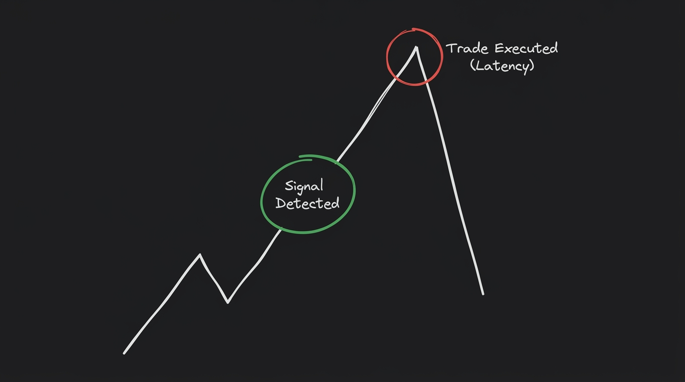

## The necessity of fresh data

In the world of algorithmic options scalping, your entire strategy is only as good as the data feeding it. If your execution engine is the muscle of your bot, the data ingestion pipeline is the central nervous system. 

When you are trying to capture micro-trends in index options, the market state changes violently in the span of milliseconds. If your system is dealing with even a half-second of latency, you aren't trading the actual market—you are trading a **"ghost" price** that no longer exists. 

Imagine your bot detects a golden entry signal and fires off a market order, only to realize the premium has already spiked 4% in the time it took your data to arrive. That delay translates directly into brutal slippage. If you want to survive as a retail algorithmic trader, ensuring your data is absolutely fresh isn't just an optimization; it is a strict baseline requirement for profitability.


**The Slippage Tax:** In scalping, a 500ms data delay doesn't just reduce your profit—it actively turns winning strategies into losing ones by forcing you to buy the top of every whip-saw.


## The mechanics: WebSockets vs. REST APIs

If you are a web developer, you are probably used to fetching data via standard REST API calls. You send a request to the server, the server processes it, and it sends a response back. 

In algorithmic trading, relying on REST APIs for live market data is a death sentence. Here is why: every single time you make a REST call, your system has to open a new HTTP connection, perform a TLS handshake, wait for the server to query its database, and then wait for the response to travel back over the network. 

When you poll an API continuously, these round-trip times stack up. On a typical retail broker API, a single REST call might take anywhere from **500ms to 800ms**. By the time you receive the data, the market has already moved.

This is where **WebSockets** come in. Instead of opening and closing a new connection for every request, a WebSocket opens a single, persistent, bidirectional connection. The server continuously pushes fresh data down that open pipe the exact millisecond a trade occurs on the exchange. By eliminating the constant handshakes and HTTP overhead, WebSockets slash latency down to roughly **200ms or less**. 

For a scalping bot, that ~400ms difference is the gap between a highly profitable trade and a devastating loss.


**The Mental Model:** Think of REST APIs like repeatedly refreshing a web page to check if you got a new email. WebSockets are like receiving a push notification the exact millisecond the email arrives.


## How our system achieves real-time ingestion

To build our data ingestion pipeline, we utilized the Kotak Neo API's `nse_cm` (NSE Cash Market) spot feed. When the bot initializes, it immediately spawns an isolated background thread dedicated entirely to managing the WebSocket connection. 

This thread has exactly one job: ingest raw tick data as fast as the exchange can spit it out. Every time a new tick arrives for the Nifty 50, it routes that tick into a custom **Aggregator Module**. 

Instead of waiting for the broker to package and send a 1-minute candle, our aggregator continuously builds custom **15-second OHLCV (Open, High, Low, Close, Volume) candles** locally in memory. The second a 15-second interval closes, the finished candle is instantly flushed to the main Strategy Engine. Because this ingestion and aggregation happens in a completely decoupled thread, the main thread is never blocked, allowing our strategy indicators (like the TWAP and EMA) to update with absolutely zero lag.

## The 6-Feed Dynamic Subscription Strategy

Getting fast data is only half the battle; ensuring you are getting data for the *correct* instrument is where most bots fail. 

In options scalping, you want to trade the **At-The-Money (ATM)** strike because it offers the best balance of delta and liquidity. But the index moves fast. If the Nifty 50 suddenly drops by 50 points, the ATM strike shifts. 

A poorly designed bot will detect this shift, send a new subscription request to the WebSocket for the new strike, and wait for the broker to acknowledge it before it can start aggregating data again. In a fast-moving market, that brief reconnection pause can completely ruin your entry.

To solve this, our bot uses a **Dynamic Subscription Strategy**. Instead of just subscribing to the current ATM strike, the bot preemptively subscribes to a net of **6 different options feeds** (alongside the underlying spot feed):
1. The current ATM Call (CE) and Put (PE).
2. One strike Out-of-The-Money (OTM) for both CE and PE.
3. One strike In-The-Money (ITM) for both CE and PE.

By monitoring this wide 6-strike net concurrently, our bot already has the live data streaming for the *next* ATM strike before the index even gets there. When the underlying price crosses the threshold, the strategy engine simply switches which local data buffer it reads from. Zero reconnection latency, zero missed ticks.


flowchart LR
    subgraph Kotak WebSocket
        direction TB
        A[Spot Feed]
        B[ATM CE / PE]
        C[OTM CE / PE]
        D[ITM CE / PE]
    end
    
    F((Aggregator Thread))
    
    A & B & C & D -->|Raw Ticks| F
    F -->|15s Candles| G[Strategy Engine]

